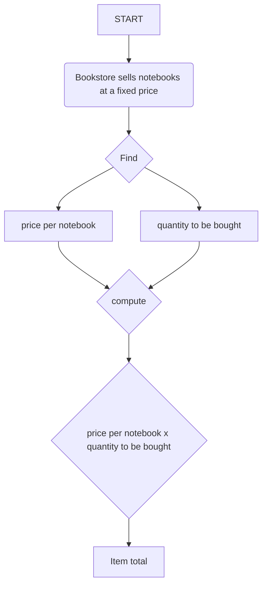

```mermaid
flowchart TD
    A[START] --> B(Bookstore sells notebooks at a fixed price)
    B --> C{Find}
    C --> D[price per notebook]
    C --> E[quantity to be bought]
    D --> F{compute}
    E --> F{ compute}
F --> G{price per notebook x quantity to be bought}
G --> H[Item total]
```
